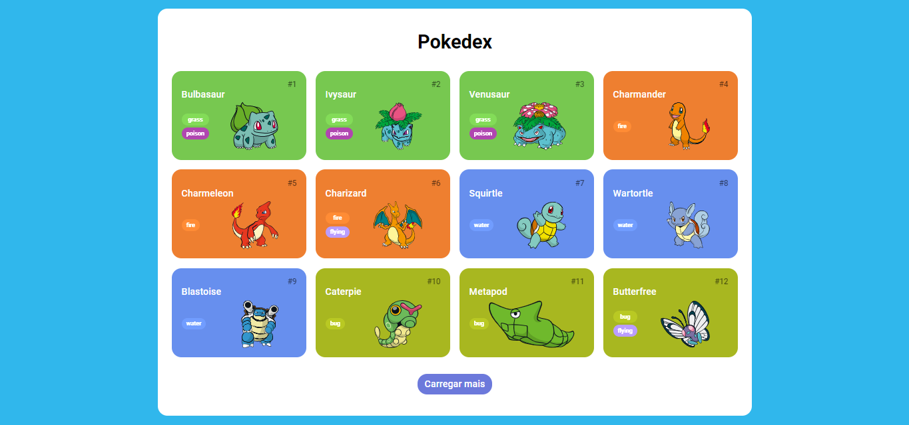
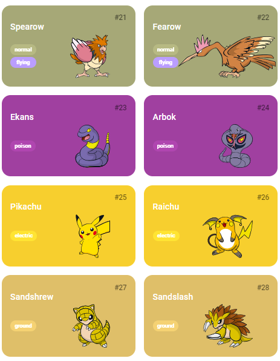

# Pokedex

Aplicação de uma Pokedex feita em JavaScript para listagem de pokemons e com integração com a PokeAPI.

## Tecnologias utilizadas no projeto
* HTML
* CSS
* JavaScript

<h3>Contribuindo</h3>

⭐️ Star o projeto

🐛 Encontrar e relatar issues
